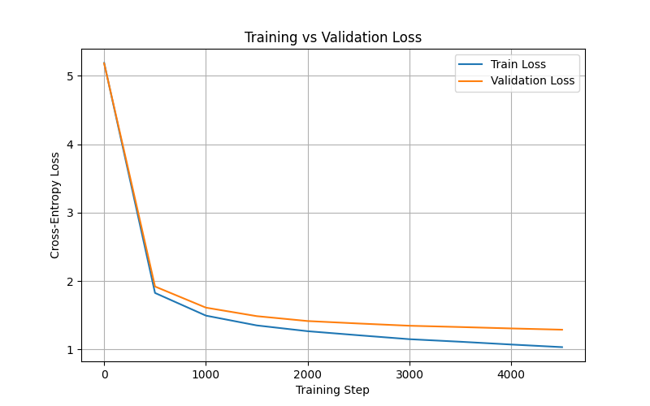

# GPTLyricsGenerator 🎶

A character-level GPT language model trained on Drake’s lyrics dataset.  
Given a starting word or phrase, the model generates new lyric-like text in Drake’s style.  

---

## ✨ Features
- Transformer-based GPT architecture implemented **from scratch** in PyTorch  
- ~7.3M trainable parameters  
- Token + positional embeddings for sequence modeling  
- Multi-head self-attention and residual connections  
- Dropout regularization and AdamW optimizer  
- Training/validation **loss curve plots** for performance tracking  
- Generates text conditioned on user-provided prompts  

---

## 📊 Training Metrics
- **Dataset**: Drake lyrics (character-level)  
- **Final Train Loss**: ~1.0  
- **Final Validation Loss**: ~1.2  
- **Parameters**: ~7.3M  

---

## Example output
Input: "The moonlight shines"
{"The moonlight shines rolling what shittle tin' makes but and you should let you to me i'm clippon your tell gets a mark and enough you wanna be no hook as you live called it all up op my team give thought scare y'all of past niggas it's not playin' yeah of tire shit it sounds you a couple home i better now the conder what i know im to get one someback my spoician culanin'   drake im some i kid i know uh uh like a missan wihall tryna la tate the why mutic's for you wanna atta question me too huw hard a right diesign"}

---

## Loss curve (Train vs Validation):

